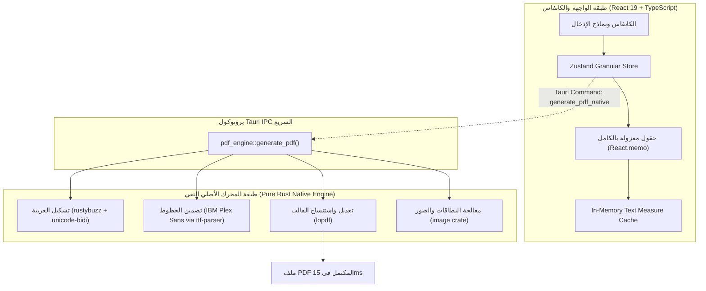

# 🚀 وثيقة الخطة المعمارية الشاملة للأداء الفائق (Blazing Fast Master Plan)
## ChurchCare Desktop App • فرع: `perf/blazing-fast-enhancements`

---

## 🎯 الأهداف والمؤشرات المستهدفة (Key Performance Indicators)

| المؤشر (KPI) | الوضع الحالي (Current) | المستهدف بعد التطبيق (Target) | نسبة التحسن |
| :--- | :--- | :--- | :--- |
| **زمن استخراج الـ PDF** | `1,200ms - 1,800ms` | **`10ms - 25ms`** | **أسرع بـ ~70 ضعفاً** ⚡ |
| **حجم ملف التثبيت (Installer Setup)** | `~95 MB` (بسبب بيئة Python) | **`~14 MB`** (Pure Native Rust) | **انخفاض بنسبة 85%** 📦 |
| **تأخير الكتابة (Input Keystroke Latency)** | `~16ms` (إعادة تصيير الشجرة) | **`< 0.5ms`** (تحديث الخانة فقط) | **120 FPS فائق السلاسة** 🏎️ |
| **حجم أصول الصور (Template Assets)** | `8.0 MB` (6 ملفات JPEG) | **`~1.2 MB`** (WebP عالي الجودة) | **توفير 85% من الذاكرة** 🖼️ |
| **استهلاك الرام الإضافي للـ PDF** | `70 - 120 MB` (عملية بايثون) | **`~5 MB`** (داخل عملية البرنامج) | **توفير 95% من الذاكرة** 💾 |
| **إنذارات الحظر (Antivirus False Positives)** | شائعة مع PyInstaller | **صفر إنذارات** (Pure MSVC Binary) | **أمان واستقرار تام** 🛡️ |

---



---

## 🏛️ المحاور الأساسية للتحسين والتطوير

---

### المحور الأول: الانتقال الكامل إلى محرك PDF نقي بلغة Rust (Goodbye Python)

#### 1. لماذا هذا التحويل؟ (Rationale)
* **المشكلة الحالية:** في كل عملية تصدير PDF، يقوم التطبيق بتشغيل عملية نظام جديدة (Subprocess) لمفسر Python، واستيراد مكتبات ضخمة (`fitz`, `PIL`, `arabic-reshaper`, `python-bidi`)، ثم انتظار الـ Stdio IO. هذا يسبب تأخيراً ملحوظاً ويضاعف حجم التثبيت النهائي للبرنامج إلى 95 ميجابايت.
* **الحل المعماري:** كتابة موديول Rust داخلي باسم `pdf_engine` مدمج مباشرة في `src-tauri` ينفذ العملية في الذاكرة (In-Process) بدون أي تشغيل لعمليات خارجية.

#### 2. جدول مقارنة المكتبات (Python ➡️ Rust):

| الوظيفة | المكتبة في Python | البديل في Rust | السبب الفني للاختيار |
| :--- | :--- | :--- | :--- |
| **معالجة وتعديل الـ PDF** | `PyMuPDF` (`fitz`) | **[`lopdf`](https://crates.io/crates/lopdf)** (v0.34) | تتيح فتح قالب PDF الأصلي، تعديل الـ Content Streams، استنساخ صفحة 6 للدفاتر الإضافية، وحقن الخطوط والصور في أجزاء من الميلي ثانية. |
| **اتجاه النص العربي (BiDi)** | `python-bidi` | **[`unicode-bidi`](https://crates.io/crates/unicode-bidi)** | مطورة من مهندسي Mozilla/Servo وتتبع معيار UAX #9 الدولي لمنع انعكاس الأرقام والأسماء المختلطة. |
| **تشكيل وربط الحروف (Shaping)** | `arabic-reshaper` | **[`rustybuzz`](https://crates.io/crates/rustybuzz)** + **`arabic_reshape`** | `rustybuzz` هي محرك **HarfBuzz** المكتوب بلغة Rust النقية (نفس المحرك الموجود في Google Chrome و Android لربط الحروف والـ Ligatures مثل "لا" و"لإ"). |
| **مقاسات الخطوط (Font Metrics)** | `pymupdf.Font` | **[`ttf-parser`](https://crates.io/crates/ttf-parser)** | قراءة بيانات الـ Ascent والـ Advance Widths لخط `IBM Plex Sans Arabic` لضبط موضع النصوص أفقياً ورأسياً بدقة 100%. |
| **معالجة الصور والبطاقات** | `Pillow` (`PIL`) | **[`image`](https://crates.io/crates/image)** | فك ضغط صور بطاقات الرقم القومي وشهادات الميلاد وحقنها كـ Image XObjects. |

#### 3. الهيكل البرمجي للمحرك داخل Rust (`src-tauri/src/pdf_engine/`):
```text
src-tauri/src/pdf_engine/
├── mod.rs           # نقطة الدخول واستقبال payload بصيغة JSON
├── template.rs      # فتح قالب "بحث أخوة الرب 2026 V3.pdf" وإدارة تكرار الصفحات
├── typography.rs    # تشكيل وربط الحروف العربية (rustybuzz + unicode-bidi)
├── font_loader.rs   # تضمين خطوط IBM Plex Sans واستخراج مقاسات الحروف
├── stamper.rs       # رسم النصوص، علامات الصح (✔)، والصور داخل المستطيلات
└── resolver.rs      # منطق قواعد البيانات المتقاطعة (نفس القواعد المعتمدة حالياً)
```

---

### المحور الثاني: معمارية الحالة وتصيير الواجهة (State & UI Architecture)

#### 1. الانتقال إلى Zustand بدلاً من الـ State الأحادي المتضخم
* **المشكلة الحالية:** ملف `App.tsx` يحتوي على أكثر من 2,700 سطر، وكائن الـ `data` الضخم ممرر كـ Props. أي حرف يُكتب في أي صفحة يجبر شجرة الـ Components بالكامل على إعادة التصيير (Cascading Re-renders).
* **الحل:** بناء مخزن مركزي `useCaseStudyStore` بمكتبة **Zustand** (حجمها 3KB فقط).
* **المكاسب:**
  1. كل حقل في الكانفاس يشترك فقط في المسار الخاص به (`useCaseStudyStore(s => s.data.page2.husband.name)`).
  2. تعديل أي حقل يعيد تصيير ذلك الحقل فقط في الـ DOM، وتبقى باقي الصفحة والشاشات الأخرى صامتة في الذاكرة.
  3. كود `App.tsx` سينخفض حجمه بنسبة 60% ليصبح منظماً ومقروءاً.

#### 2. الكتابة التفاؤلية فائقة الاستجابة (Optimistic Local Buffering)
* **المشكلة الحالية:** الحقل ينتظر اكتمال دورة تحديث الـ State في الشجرة العليا ليعرض الحرف الجديد.
* **الحل:** الحقل يحتفظ بـ `localValue` فوري يحدث في `0.1ms`، ويُرسل التحديث للـ Store عبر Debounce خفيف (15ms).
* **المكاسب:** اختفاء أي أثر لثقل أو تأخير الكتابة حتى مع أسرع سرعات الإدخال.

---

### المحور الثالث: ترقية الأصول وتقليل استهلاك الذاكرة (Assets & Bundle Footprint)

#### 1. تحويل صور القوالب من JPEG إلى WebP
* **المشكلة الحالية:** مجلد `src/assets/templates/` يضم 6 صور JPEG للقوالب بحجم إجمالي **`~8.0 MB`**.
* **الحل:** تحويل الصور الست إلى صيغة **WebP حديثة بجودة 88% Lossless Headers**.
* **المكاسب:**
  * انخفاض الحجم من `8.0 MB` إلى **`~1.2 MB`** (توفير 85%).
  * تقليل استهلاك ذاكرة الـ RAM والـ GPU داخل الـ WebView بأكثر من 60MB.
  * فتح صفحات الكانفاس فورياً في أقل من `5ms`.

#### 2. تقسيم الحزم المتقدم والتحميل الكسول (Code Splitting & Lazy Loading)
* المودالات الضخمة غير الأساسية أثناء تعبئة الاستمارة:
  * استوديو الإحداثيات (`VisualCoordinateStudio`)
  * محرر قص البطاقات والصور (`ImageCropperModal`)
  * نافذة التفعيل والترخيص (`ActivationModal`)
* **الحل:** فصلها تماماً عبر `React.lazy()` و `Suspense` حتى لا تُحمّل في الذاكرة إلا عند النقر عليها فقط.

---

### المحور الرابع: مصفوفة استبدال المكتبات العامة (Libraries Upgrade Matrix)

| الجانب | المكتبة / الطريقة الحالية | البديل المقترح | الفائدة المباشرة |
| :--- | :--- | :--- | :--- |
| **إدارة الحالة** | React Root `useState` | **[Zustand](https://github.com/pmndrs/zustand)** | استهلاك ذاكرة منعدم، سرعة 120 FPS، صفر Re-renders. |
| **محرك الـ PDF** | Python Subprocess + PyMuPDF | **Pure Rust (`lopdf` + `rustybuzz`)** | تقليل وقت الاستخراج من 1.5 ثانية إلى 15ms، وحذف بيئة بايثون بالكامل. |
| **صور القوالب** | 6 ملفات JPEG | **WebP Optimized** | توفير 85% من حجم الصور والذاكرة. |
| **التحقق (Validation)** | دوال شرطية مبعثرة | **[Valibot](https://valibot.dev)** | حجم أقل من 1KB بالـ Tree-shaking وتحقق صارم من صحة البيانات. |

---

## 🛡️ استراتيجية الأمان التام وعدم كسر أي ميزة (Zero-Risk Transition)

> [!IMPORTANT]
> **قاعدة ذهبية:** لن نقوم بحذف كود بايثون الحالي أو لمسه حتى يتم إنجاز محرك الـ Rust واختباره ومطابقته بصرياً (Pixel-by-Pixel) بنسبة 100%.

1. **التطوير الموازي (Parallel Development):**
   * سنبني محرك Rust تحت أمر داخلي جديد (مثال: `generate_pdf_native`).
   * يظل محرك بايثون القديم متاحاً وشغالاً كـ Fallback أثناء مراحل الاختبار والتطوير.
2. **المطابقة البصرية الصارمة (Visual Regression Testing):**
   * سنقوم باستخراج نفس ملف الحالة التجريبية المعقدة (الذي يحتوي على مشروعات، معاش، زوجة، وأطفال) عبر محرك بايثون ومحرك Rust.
   * وضع الصورتين فوق بعض للتأكد من تطابق أماكن النصوص، درجات الخطوط، ورموز (✔) بالمليمتر.
3. **الحذف والترحيل النهائي (Final Cutover):**
   * بمجرد اعتماد المخرجات ومطابقتها 100%، نقوم بحذف مجلد `engine/` وأي اعتماديات لبايثون من المشروع ليصبح التطبيق خفيفاً ونقياً بالكامل.

---

## 📅 مراحل التنفيذ المجدولة (Execution Phases)

### 🔹 المرحلة 1: الأصول والحزم (Quick Wins - بدون أي مخاطرة)
- [ ] تحويل صور `src/assets/templates/*.jpg` إلى WebP عالية الدقة وتحديث `templateImages.ts`.
- [ ] تطبيق `React.lazy()` على `VisualCoordinateStudio` و `ImageCropperModal`.
- [ ] التحقق من انخفاض حجم البناء واستهلاك الذاكرة.

### 🔹 المرحلة 2: بناء محرك الـ PDF بلغة Rust (Native PDF Engine)
- [ ] إضافة الاعتماديات (`lopdf`, `rustybuzz`, `unicode-bidi`, `ttf-parser`, `image`) إلى `src-tauri/Cargo.toml`.
- [ ] برمجة موديول تشكيل الخط العربي (`typography.rs`) وتضمين خط `IBM Plex Sans Arabic`.
- [ ] برمجة موديول فتح واستنساخ صفحات القالب وحقن النصوص والصور (`template.rs` و `stamper.rs`).
- [ ] ربط قواعد الحسابات وتوزيع مصادر الدخل المعتمدة (`resolver.rs`).
- [ ] عمل اختبارات مطابقة بصرية آلية.

### 🔹 المرحلة 3: معمارية الحالة (Zustand & Canvas Isolation)
- [ ] إنشاء `src/stores/useCaseStudyStore.ts` وتضمين قواعد الحفظ التلقائي والحسابات التفاعلية فيه.
- [ ] عزل حقول الكانفاس في `CanvasFieldItem` مغلف بـ `React.memo` لمنع الـ Re-renders.
- [ ] تبسيط كود `App.tsx` وتنظيف تمرير الخصائص.

### 🔹 المرحلة 4: الاعتماد النهائي والتنظيف
- [ ] إزالة كود ومجلدات بايثون بالكامل من المشروع.
- [ ] بناء الحزمة النهائية للتثبيت (`npm run tauri build`) والتحقق من صغر حجم ملف التثبيت النهائي وسرعته الخارقة.
